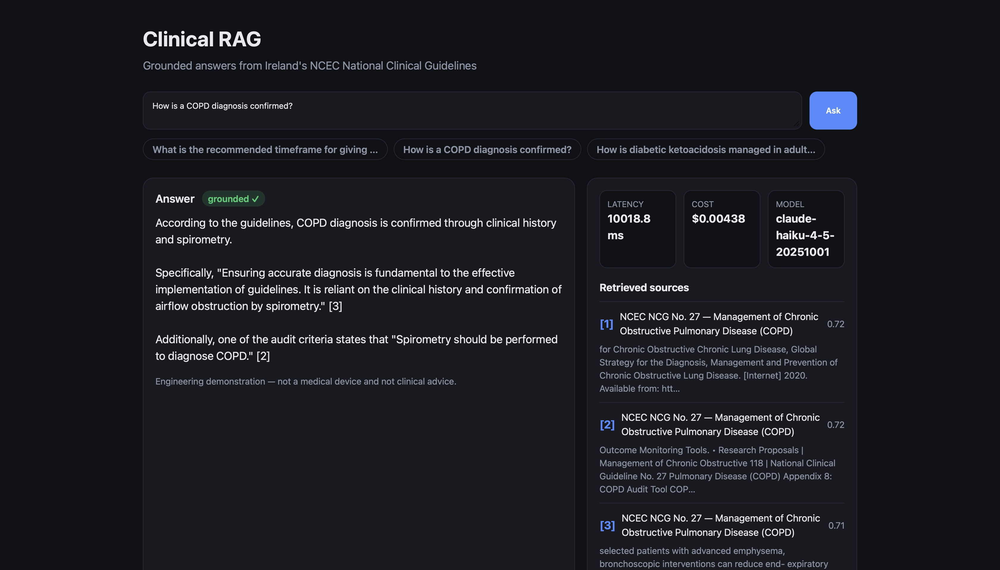
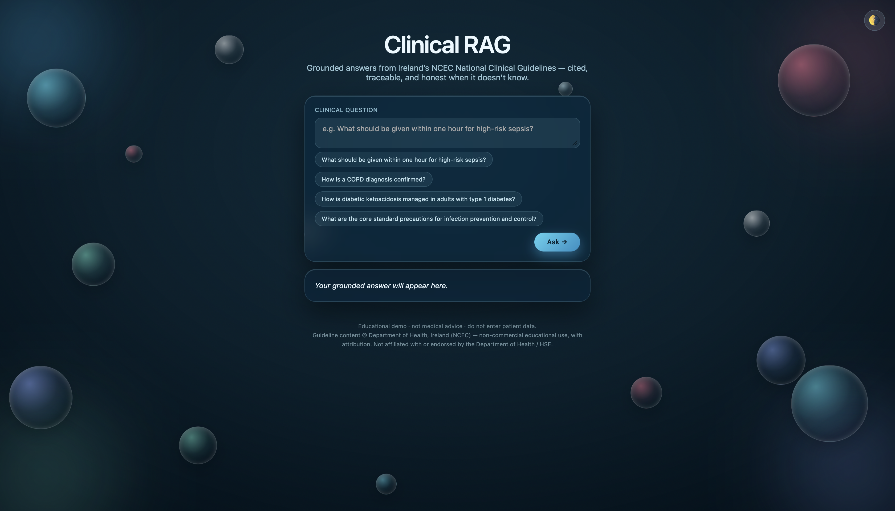
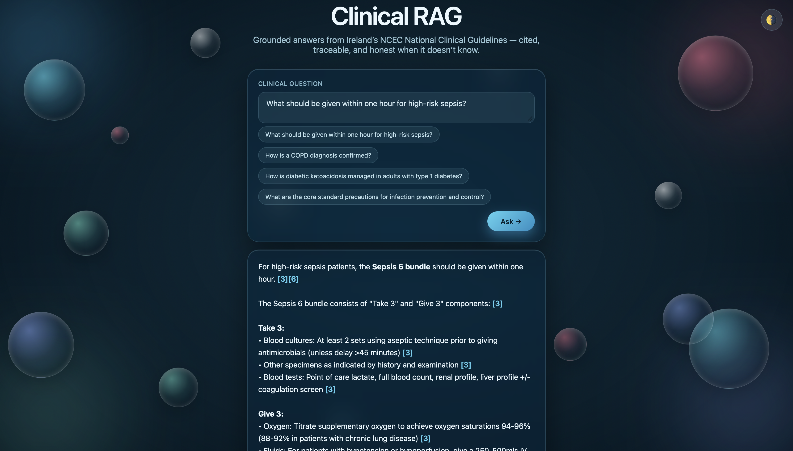
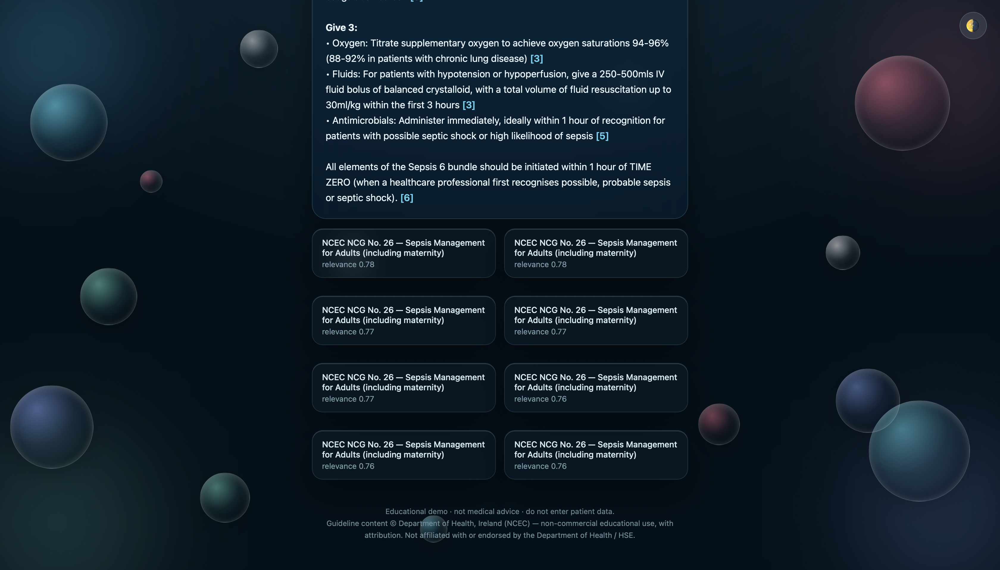

# Clinical RAG System

**🔗 Live demo:** https://robert-b38-clinical-rag.hf.space  ·  **Code:** https://github.com/RobertB-38/clinical-rag-system

A retrieval-augmented generation (RAG) service that answers clinical questions **grounded in Ireland's NCEC National Clinical Guidelines**, with inline citations and an explicit refusal when the evidence is weak.

Built as a focused engineering project to demonstrate three things end to end: **building with LLMs (RAG)**, **shipping a deployed production service**, and **working safely in a regulated clinical domain**.

> ⚕️ **Not a medical device.** This is an engineering demonstration. It does not provide medical advice and must not be used for clinical decision-making.

---

## Production upgrade (v0.2) — the LLMOps layer

The original project proved retrieve-then-generate RAG. **v0.2 wraps it in the production layer that separates a demo from a hire:** evaluation, observability, cost control, guardrails, Kubernetes, and a React UI. The core stays a clean retrieve-then-generate service; everything below is built *around* it.



*The React UI: a grounded, cited answer streaming in, with the retrieved NCEC sources (and similarity scores), per-answer latency, cost, and the router-selected model.*

### Request lifecycle
```
question
  → input guardrail        (PII redaction · prompt-injection block · rate limit)
  → retrieve               (BGE embed → Chroma top-k)         ┐
  → relevance gate         (refuse if best score < threshold) │ OTel span +
  → generate               (router: cheap Haiku vs frontier Sonnet, cited) │ Prometheus
  → output guardrail       (groundedness check, else refuse)  ┘ metrics per step
  → stream (SSE)           tokens + sources + latency + cost  → React UI

offline:  eval harness replays a fixed clinical test set in CI and fails on regression
```

### What each gap maps to
| Gap (from the JDs) | Component | Where |
|---|---|---|
| Evaluation | correctness + groundedness + citation scorers, CI gate | `eval/`, `.github/workflows/ci.yml` |
| Observability | OpenTelemetry spans + Prometheus `/metrics` + Grafana | `app/observability.py`, `ops/` |
| Cost / LLMOps | model router + per-request token/cost accounting | `app/rag/router.py`, `app/cost.py` |
| Guardrails | PII redaction, injection block, **output groundedness**, rate limit | `app/guardrails.py` |
| Kubernetes | manifests + HPA + k6 load test + SLOs | `k8s/`, `load/`, `docs/SLOs.md` |
| React | streaming chat + sources/latency/cost panel | `frontend/` |

### Run the whole stack
```bash
# API + Prometheus + Grafana (Grafana on :3000, dashboard auto-provisioned)
make serve-stack

# eval with the CI regression gate
make eval-check

# local Kubernetes + autoscaling under load
make k8s-deploy && make k8s-load     # see docs/DEPLOY_K8S.md
```

> **Honest scope:** local k3s/minikube proves the Kubernetes skill and autoscaling, not production uptime — the public demo URL stays the Hugging Face Space. The model router is justified by *measured* cost savings, not asserted. See `docs/SLOs.md` for targets and known limitations.

---

## Why this project

Most "RAG demos" are a notebook wrapping an LLM call. This one is deliberately built like a product:

| Goal | How this project shows it |
| --- | --- |
| **GenAI / LLM / RAG engineering** | Hand-built pipeline — chunking, local embeddings, vector search, grounded generation — no framework hiding the mechanics, so every step is explainable. |
| **Production / deployed systems** | Typed FastAPI service, test suite, containerised, and **deployed to a live public URL** with a demo UI. Not "runs on my laptop" — runs where anyone can hit it. |
| **Clinical domain credibility** | Real guideline corpus, answers grounded strictly in retrieved sources, a relevance threshold that triggers a safe refusal, a faithfulness metric, and a clear non-device disclaimer. |

---

## Demo

A liquid-glass interface over the FastAPI backend:



A grounded answer with inline citations — the Sepsis Six bundle, drawn from NCEC NCG 26:



Every answer returns the retrieved guideline passages and their relevance scores, so any claim is traceable to source:



---

## Architecture

```
                    ┌─────────────────────────────────────────────┐
   question  ─────► │  FastAPI  /v1/query                         │
                    │                                             │
                    │   1. embed query      (BGE-small, local)    │
                    │   2. vector search    (Chroma)              │
                    │   3. relevance gate   (score threshold)     │
                    │   4. grounded answer  (Claude, cited)       │
                    └─────────────────────────────────────────────┘
                                      ▲
                                      │ build-time
        guideline PDFs ──► load ──► chunk ──► embed ──► Chroma index
```

Every external dependency sits behind a small interface with two implementations — a real one and a lightweight fake — so the whole pipeline is testable with no API key and no model download:

| Component | Real (production) | Fake (tests / CI) |
| --- | --- | --- |
| Embeddings | `BAAI/bge-small-en-v1.5` (local, free; MiniLM also supported) | deterministic hash vectors |
| Vector store | Chroma (persistent on disk) | in-memory NumPy cosine |
| Generation | Anthropic Claude (Haiku 4.5 default) | echo / canned |

Behaviour is selected by environment variables (`RAG_EMBEDDING_PROVIDER`, `RAG_VECTOR_STORE`, `RAG_LLM_PROVIDER`), so the same code runs free-and-offline for development and fully-featured in production.

---

## Tech stack

- **Language / runtime:** Python 3.11
- **API:** FastAPI + Uvicorn, Pydantic v2 models, `pydantic-settings` config
- **Embeddings:** sentence-transformers (BGE-small with query/passage prefixes; MiniLM selectable) — runs on CPU, no cost
- **Vector store:** Chroma (local, persistent)
- **Generation:** Anthropic Claude via the official `anthropic` SDK
- **Ingestion:** `pypdf` + `langchain-text-splitters` (splitter only)
- **Testing:** pytest + Starlette TestClient
- **Packaging / deploy:** Docker, deployed to Hugging Face Spaces (live demo UI)

Deliberately **not** used, and why: no LangChain/LlamaIndex (hand-rolling keeps the RAG mechanics explainable); no Kubernetes (single-container service — would be over-engineering); no fine-tuning (RAG is the right tool for grounding in current documents).

---

## Safety design (clinical domain)

This is the part that matters most for a healthcare context:

1. **Grounded-only answers.** The model is instructed to answer *only* from retrieved guideline text and to cite the source titles it used.
2. **Refusal on weak evidence.** If the best retrieved chunk scores below a relevance threshold, the system returns *"I don't have guidance on that in the indexed guidelines"* instead of guessing.
3. **Traceable sources.** Every response returns the source documents and the exact retrieved passages, so any answer can be checked against the original guideline.
4. **Faithfulness evaluation.** The eval harness checks that answers only cite sources that were actually retrieved.
5. **Explicit non-device disclaimer**, surfaced in the API and UI.

---

## Responsible AI & limitations

This is a clinical-domain demo, so its limits are stated plainly rather than hidden:

- **Not a medical device and not clinical advice.** It is an engineering demonstration. It must not inform real clinical decisions, and the UI says so prominently.
- **No personal/health data.** The system needs none and users are told not to enter patient information; nothing is stored.
- **Grounded, not omniscient.** Answers come only from the indexed guidelines. Retrieval can surface the wrong passage, and the language model can misread or omit a citation — `hit@k` and `citation_validity` measure exactly these failure modes rather than hiding them.
- **Narrow corpus.** Currently 10 Irish NCEC guidelines. Anything outside that scope triggers a refusal by design, not a guess.
- **No clinical validation.** Outputs have not been reviewed by clinicians; the project demonstrates the engineering, not medical correctness.
- **Transparency by default.** Every answer returns its retrieved source passages and relevance scores so any response can be traced back to the guideline text.

---

## API

`GET /health` → `{"status": "ok", "version": "..."}`

`POST /v1/query`
```json
{ "question": "What are the first-line antibiotics for adult sepsis?", "top_k": 4 }
```
Returns the grounded answer, the deduplicated source list, and the retrieved passages with similarity scores.

---

## Running locally

```bash
pip install -r requirements.txt

# 1) build the index from the guideline corpus
python -m app.ingest.run

# 2) serve the API
uvicorn app.main:app --reload
```

Set `RAG_ANTHROPIC_API_KEY` (or a `.env` file) to enable Claude generation. Without it, run with `RAG_LLM_PROVIDER=fake` to exercise retrieval only.

With Docker:
```bash
docker build -t clinical-rag .
docker run -p 8000:8000 -e RAG_ANTHROPIC_API_KEY=sk-... clinical-rag
```

---

## Corpus

The corpus is Ireland's **NCEC National Clinical Guidelines** (Department of Health / HSE) — a single, authoritative guideline body, chosen so retrieval never has to reconcile conflicting advice from different authorities. The full suite is catalogued in [`data/sources.yaml`](data/sources.yaml) with title, source URL, retrieval date, and licence per document.

Currently indexed: **10 guidelines (~3,000 chunks at 350-token passages)** — sepsis, COPD, acute asthma, type 1 diabetes, infection prevention & control (2 vols), MRSA, *C. difficile*, hepatitis C screening, and smoking cessation. The manifest plus the ingestion script make the index reproducible from scratch.

**Attribution & use.** Guideline content is from the NCEC National Clinical Guidelines, © Department of Health, Ireland, and the respective Guideline Development Groups, reproduced here for **non-commercial, educational purposes only** with attribution. This project is not affiliated with or endorsed by the Department of Health or HSE, and is **not for clinical use**. NCEC content may not be reproduced for commercial purposes without permission.

---

## Evaluation

`python -m eval.run_eval` scores the system against a hand-written question set ([`eval/qa.yaml`](eval/qa.yaml)) on two metrics:

- **hit@k** — did retrieval surface the correct guideline for each question?
- **citation_validity** — do the answer's `[n]` citations point only to passages that were actually retrieved (i.e. no fabricated references)?

**v0.2 adds scored metrics** beyond retrieval: `keyword_correctness` (deterministic), and LLM-judge `judge_correctness` / `judge_groundedness`. The deterministic metrics gate CI via `eval/thresholds.yaml`; the judge metrics are reported, not gated (they're noisier). Run `make eval-check`.

**Results** (13 questions over the 10 indexed guidelines; BGE-small embeddings, Claude Haiku 4.5 generation and judge, top-k = 8):

| Metric | Score | Source |
| --- | --- | --- |
| hit@k | **1.00** (13/13) | measured |
| citation_validity | **1.00** | measured |
| keyword_correctness | **0.885** | deterministic |
| judge_correctness | **0.82** | LLM-judge (Haiku) |
| judge_groundedness | **0.95** | LLM-judge (Haiku) |

> Real numbers from `python -m eval.run_eval`. `judge_correctness` at 0.82 (not a suspicious 1.0) is the honest signal of an LLM-judge — it docks partial/incomplete answers. The judge here is Haiku; set `RAG_EVAL_JUDGE_MODEL=claude-sonnet-4-6` for a stronger (pricier) judge.

Notes for honest reading:
- Embeddings were upgraded from MiniLM to **BGE-small** after the original evaluation. MiniLM scored a perfect-looking hit@k but several answers *refused in practice* — it retrieved the right guideline but the wrong passage (e.g. COPD epidemiology instead of the spirometry/diagnosis section). BGE fixed those real refusals.
- The old "stop-smoking pharmacotherapy" miss (hit@k 0.92) is **resolved at top-k = 8**: widening retrieval surfaces the dedicated Stop Smoking guideline above the COPD chunks that used to outrank it, taking hit@k to 1.00.
- `judge_groundedness` 0.95 reflects answers staying close to retrieved text; the gap from 1.0 includes honest cases like the DKA-dosing question, where the model correctly says the dose isn't in the corpus rather than inventing one.

---

## Roadmap

- [x] **Day 1** — FastAPI skeleton: `/health`, `/v1/query` stub, Pydantic models, Docker base
- [x] **Day 2** — Ingestion pipeline: load → chunk → embed → Chroma; provider config; sample corpus
- [x] **Day 3** — Retrieval wired into `/v1/query` (real chunks + scores returned)
- [x] **Day 4** — Claude grounded generation with citations + relevance-gated refusal
- [x] **Day 5** — Evaluation harness (hit@k, citation_validity), Gradio demo UI, Docker Compose
- [x] **Corpus** — 10 Irish NCEC guidelines indexed (~3,900 chunks); hit@k 1.00, citation_validity 0.85
- [ ] **Remaining** — deploy to a live Hugging Face Space URL (see [DEPLOY.md](DEPLOY.md)); optionally expand the corpus to the full NCEC suite

---

## Resume bullets this project earns

Each maps to something in this repo that runs — no claim without code behind it.

- Built a **production RAG service** over Irish NCEC clinical guidelines (FastAPI, ChromaDB, BGE embeddings) with **token-streaming (SSE)** answers, inline citations, and a relevance-gated refusal — deployed and load-tested.
- Designed an **LLM evaluation harness** scoring correctness, groundedness, and citation validity, **wired into CI** to fail the build on regression (`eval/` + GitHub Actions).
- Instrumented the service with **OpenTelemetry tracing and Prometheus metrics** on a **Grafana dashboard** (p50/p95/p99 latency, tokens, cost, error and refusal rates, retrieval quality).
- Implemented **cost control**: a query-complexity **model router** (cheap Claude Haiku vs frontier Claude Sonnet) with **per-request token/cost accounting** surfaced per answer — measured ~**2.5× lower cost** ($0.005 vs $0.013/answer) by routing simple queries to the cheap tier.
- Added **safety guardrails**: PII redaction, prompt-injection blocking, an **output-side groundedness check** that refuses unsupported answers, and per-client rate limiting.
- Packaged for **Kubernetes** (Docker, manifests, **HPA autoscaling**) with a **k6 load test** that triggers scaling and **documented SLOs**; built a **React** streaming UI showing sources, latency, and cost per answer.

## License

Code: MIT. Clinical guideline content remains under its original publishers' licences; see `data/sources.yaml`.
